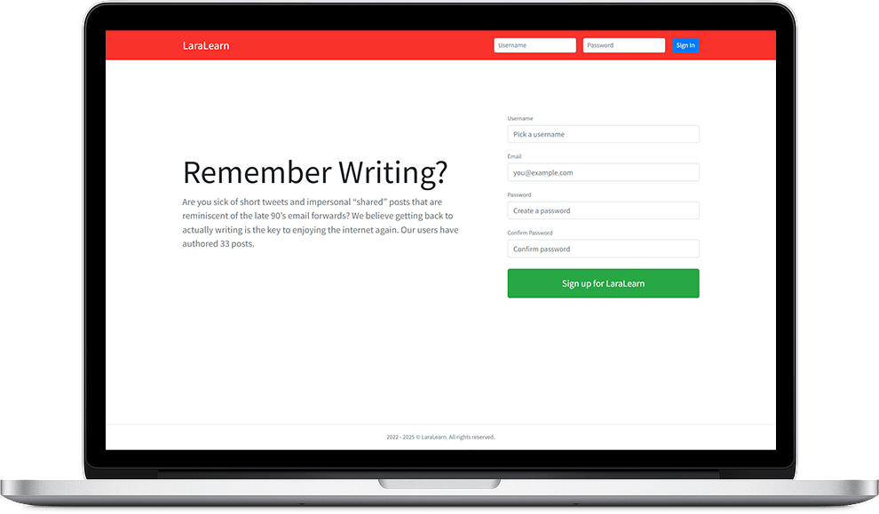

<p align="center"><a href="https://laravel.com" target="_blank"></a></p>

<h1 align="center">LaraLearn - "Let's Learn Laravel & Livewire" Course Project</h1>

<p align="center">
    
</p>

This repository contains the source code for the `LaraLearn` project, developed as part of the Udemy course **["Let's Learn Laravel & Livewire: A Guided Path For Beginners"](https://www.udemy.com/course/lets-learn-laravel-a-guided-path-for-beginners/)**, taught by instructor **[Brad Schiff](https://www.udemy.com/user/bradschiff/)**.

The project's goal is to build a simple social application, similar to a blog or Twitter, to practice the fundamental concepts and best practices of the Laravel and Livewire ecosystem, including API authentication with Sanctum and real-time features with Pusher.

---

### ⚙️ Prerequisites

Before you begin, ensure you have the following development environment set up:

* A local server environment (e.g., Laragon, XAMPP, WAMP, Herd)
* PHP 8.2 or higher
* Composer
* Node.js & NPM
* A database (MySQL, MariaDB, etc.)

---

### 📝 Installation and Setup Guide

Follow these steps to set up the project in a new environment.

1.  **Clone the Repository**
    ```bash
    git clone https://github.com/Robson16/laralearn.git
    cd laralearn
    ```

2.  **Install PHP Dependencies**
    Run Composer to download all the required backend packages (Laravel, Livewire, Sanctum, etc.).
    ```bash
    composer install
    ```

3.  **Install Front-End Dependencies**
    Run NPM to download all the required JavaScript packages (Alpine.js, Livewire assets, Pusher-JS, Axios, etc.).
    ```bash
    npm install
    ```

4.  **Set Up the Environment File**
    Copy the example environment file and generate the application key.
    ```bash
    # For Windows
    copy .env.example .env

    # For MacOS/Linux
    cp .env.example .env
    ```
    Then, generate the key:
    ```bash
    php artisan key:generate
    ```

5.  **Configure the Database**
    Open the `.env` file and configure your database variables (`DB_DATABASE`, `DB_USERNAME`, `DB_PASSWORD`).

6.  **Configure Pusher for Real-Time Chat ( Important )**
    This project uses Pusher Channels for its real-time chat functionality.

    1.  Create a free account at [pusher.com](https://pusher.com/).
    2.  Create a new **Channels** application.
    3.  Go to the "App Keys" section of your new Pusher app and copy the credentials.
    4.  Open your `.env` file and fill in the following variables:

        ```env
        BROADCAST_CONNECTION=pusher

        PUSHER_APP_ID=your_app_id
        PUSHER_APP_KEY=your_app_key
        PUSHER_APP_SECRET=your_app_secret
        PUSHER_APP_CLUSTER=your_app_cluster
        ```
    *(The `VITE_PUSHER_...` variables will be populated automatically).*

7.  **Run the Database Migrations**
    This command will create all the necessary tables, including tables for users, posts, follows, and Sanctum API tokens.
    ```bash
    php artisan migrate
    ```
    *Optional:* To populate the database with sample data (users, posts, follows), run the seeder:
    ```bash
    php artisan db:seed
    
    or

    php artisan migrate:fresh --seed
    ```

8.  **Create the Storage Link (❗️ Important)**
    To make file uploads (like avatars) publicly accessible, run this command. It creates a symbolic link from `public/storage` to `storage/app/public`.
    ```bash
    php artisan storage:link
    ```

9.  **Run the Vite Development Server (🚀 Crucial for Front-End)**
    You still need Vite running to compile front-end assets (CSS/JS) and enable hot-reloading for Livewire, Alpine.js, etc. Open a terminal in the project directory and run:
    ```bash
    npm run dev
    ```
    **Leave this terminal running** while you develop.

10. **Access the Application**
    Done! Access the project via the URL configured in your local server environment.
    * **If using Laragon/XAMPP/etc. with Virtual Hosts:** Access the URL you set up (e.g., `http://laralearn.test`).
    * **If not using Virtual Hosts:** Access via `http://localhost/laralearn` (adjust the path if necessary).

    *(Note: You do **not** need to run `php artisan serve` if you are using a local server environment like Laragon, XAMPP, WAMP, or Herd).*
    
---

### 🔧 Recommended `php.ini` Configuration (Critical!)

To avoid common issues with file uploads and image processing, it is **highly recommended** that your `php.ini` file includes the following settings. In an environment like Laragon, you can easily access this file through the menu.

```ini
; Ensures that PHP has permission to write to a temporary folder.
; Point this to the 'tmp' folder of your Laragon installation or similar.
upload_tmp_dir = "C:/laragon/tmp"

; Enables the GD library, which is required for image manipulation (e.g., with the Intervention/Image library).
extension=gd

; Allows for larger file uploads (adjust as needed).
upload_max_filesize = 50M
post_max_size = 50M

; Correct path to CA certificates for secure connections (e.g., mail, external APIs).
openssl.cafile="C:/laragon/etc/ssl/cacert.pem"
```

**Remember to restart your server (Apache/Nginx) after any changes to `php.ini`!**

---

###  ✨ Key Technologies Used

* Laravel 12.x
* Livewire 3.x
* Alpine.js
* Pusher Channels (for broadcasting)
* Laravel Sanctum (for API authentication)
* Intervention Image
* Laravel Scout

---

###  License

This project is licensed under the MIT License.

---

 ☕❤ [Robson H. Rodrigues](https://www.linkedin.com/in/robson-h-rodrigues-93341746/)
